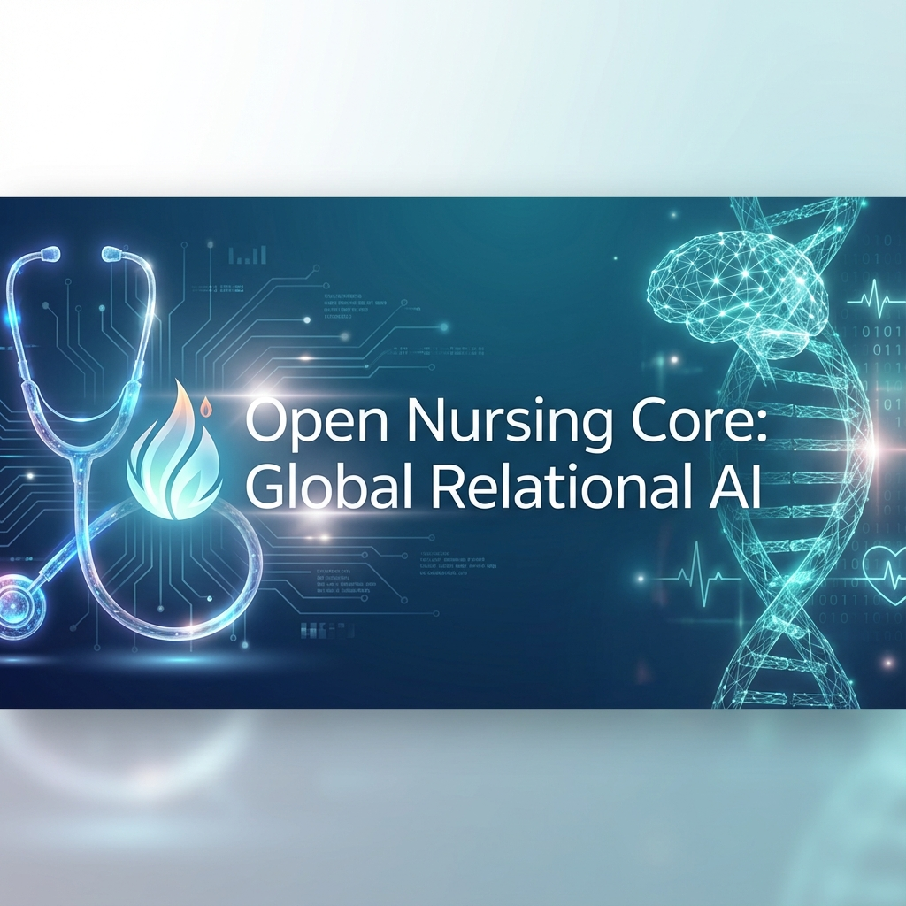

<div align="center">



# 🌍 Open Nursing Core (ONC)
### Global Relational AI for Person-Centred Care

[](https://opensource.org/licenses/MIT)
[](https://huggingface.co/spaces/NurseCitizenDeveloper/relational-ai-4-nursing)
[](http://hl7.org/fhir/R4/)
[](https://theprsb.org/)

[**Deutsch**](README.de.md) | [**Español**](README.es.md) | [**Français**](README.fr.md) | [**日本語**](README.ja.md) | [**한국어**](README.kr.md) | [**Português**](README.pt.md) | [**Русский**](README.ru.md) | [**中文**](README.zh.md)

---
</div>

## 🌟 What is the Open Nursing Core?
**Open Nursing Core (ONC)** is an open-source initiative to build the world's first **Relational AI** for nursing. Unlike traditional AI that focuses only on biomedical facts, ONC is designated to understand:
- **🫀 Clinical Safety**: Validated against "Safety Gates" (e.g., Waterlow, NEWS2).
- **💚 Relational Care**: Prioritizes empathetic and person-centred language.
- **🛡️ Evidence-Based**: Grounded in PRSB Standards and FONS nursing literature.

## 🚀 Key Features

### 🩺 1. Advanced Clinical Assistant
A specialized LLM fine-tuned on British Nursing Standards to draft high-quality care plans.
- **Input**: "Write a care plan for Mrs. Singh, 78, with dementia."
- **Output**: A structured ADPIE plan that is empathetic and clinically safe.

### 🏥 2. Virtual Multi-Disciplinary Team (MDT)
A streamlined AI synthesis tool that simulates a specialist discussion to provide a holistic care summary:
- **🩹 Tissue Viability**: Assessment prompts for skin integrity & equity (Fitzpatrick tones).
- **💚 Relational Care**: Prompts for dignity and respect.
- **🛡️ Patient Safety**: Validates against safety protocols.

### 🧠 3. Clinical Semantic Audit
Performs a deep audit of documentation against the **ONC Relational Care Logical Model** and suggests formal **NANDA-I** mappings.

---

## 🛠️ Quick Start

### Try the Live Demo
👉 [**Launch the App on Hugging Face**](https://huggingface.co/spaces/NurseCitizenDeveloper/relational-ai-4-nursing)

### Run Locally
```bash
git clone https://github.com/ClinyQAi/open-nursing-core-ig.git
cd open-nursing-core-ig/hf_space
pip install -r requirements.txt
python app.py
```

---

## 🤝 Contributing
We welcome contributions from nurses, developers, and researchers!
1. Fork the repo.
2. Create your branch: `git checkout -b feature/amazing-feature`.
3. Commit your changes: `git commit -m 'Add amazing feature'`.
4. Push to the branch: `git push origin feature/amazing-feature`.
5. Open a Pull Request.

---
**Powered by [NurseCitizenDeveloper](https://huggingface.co/NurseCitizenDeveloper)** | *Together, we code care.*

