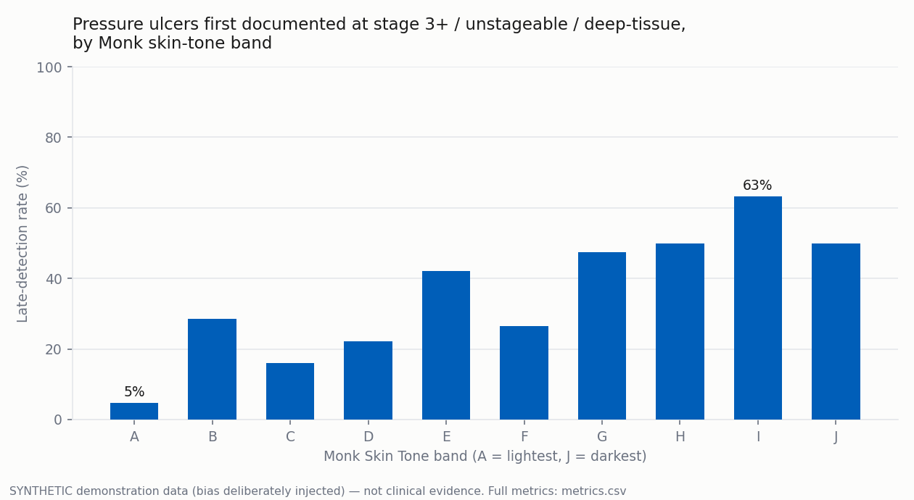

# Equity Analytics: Pressure-Ulcer Detection Timeliness by Skin Tone

This example operationalises the ONC-IG's central equity claim — *"making
inequity visible in the data is the first step to closing it"* — as a runnable
pipeline. It answers a question most services cannot currently answer at all:

> **Do our pressure-ulcer detection rates differ across skin tones?**

Because the IG records skin tone as structured data ([Monk Skin Tone
Scale](https://opennursingcoreig.com/CodeSystem-onc-monk-scale.html)) and its
fairness gate requires it on every pressure-area assessment, the question
becomes a single join — this pipeline demonstrates exactly that.



## Quickstart (synthetic demo)

```bash
pip install pandas pyarrow matplotlib
python3 generate_synthetic_data.py          # 600 synthetic patients, bias injected
python3 run_analysis.py                     # -> output/{metrics.csv, equity_report.md, *.png}
python3 generate_synthetic_data.py --bias 0 # null scenario: no inequity to find
python3 run_analysis.py
```

> ⚠️ **The demo data is synthetic and the bias is deliberately injected** so
> the pipeline has an inequity to surface. Nothing here is clinical evidence.
> The injected pattern models what the literature reports: pressure damage
> detected later on darker skin when assessment relies on redness/blanching.

## Pipeline

```
FHIR NDJSON (Patient, Monk Observation, PU Observation)
   └─> flat Parquet analysis views          (output/parquet/)
        └─> stratified metrics per Monk band A–J
             ├─> metrics.csv                (full table)
             ├─> equity_report.md           (headline disparity)
             └─> detection_delay_by_skin_tone.png
```

Metrics per band: patients assessed · pressure ulcers · median days from
skin-tone assessment to first documentation · **late-detection rate** (% first
documented at stage 3/4, unstageable, or deep-tissue injury).

## Production path: Open Health Stack fhir-data-pipes

At demo scale this script flattens NDJSON itself. Against a real FHIR server,
use the OHS Foundation's
**[fhir-data-pipes](https://github.com/ohs-foundation/fhir-data-pipes)** to do
the heavy lifting — it ETLs FHIR resources into the same kind of flat Parquet
views (Apache Beam, incremental sync, SQL-on-FHIR views):

1. Run fhir-data-pipes batch/incremental mode against your store, materialising
   views for `Patient` and `Observation` (filter: `code=mst-score` and
   SNOMED `399912005`).
2. Adapt `build_views()` in `run_analysis.py` to read the pipes Parquet output
   instead of NDJSON — the metric and chart code is unchanged.

## Governance note

Stratified equity metrics are aggregate, secondary-use analytics: apply your
information-governance process (de-identification, minimum necessary data,
DPIA) per the IG's [Security & Privacy](https://opennursingcoreig.com/security.html)
page before running this against real records. Interpretation of any real
disparity belongs with clinical and equity leadership — the pipeline makes the
question answerable; it does not answer *why*.
